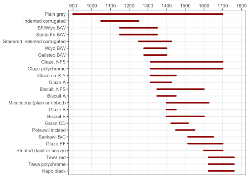
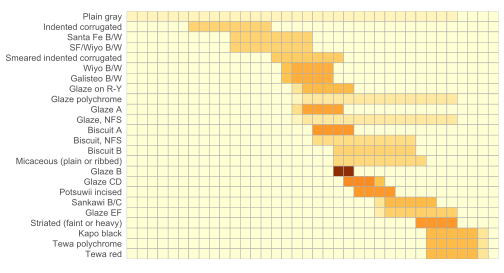
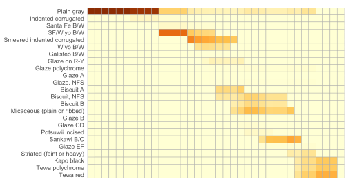
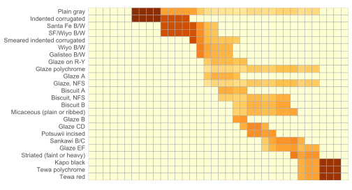
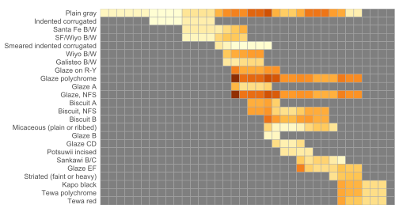
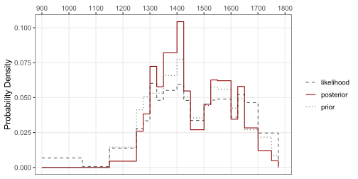
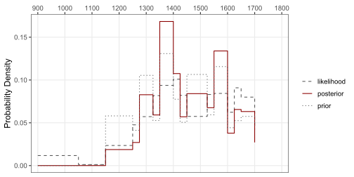

## Ortman 2016

> Ortman (2016). “Uniform Probability Density Analysis and Population
> History in the Northern Rio Grande.” *Journal of Archaeological Method
> and Theory* 23, 95–126. DOI:
> <https://doi.org/10.1007/s10816-014-9227-6>

Ortman (2016) offers a Bayesian approach to indirect ceramic dating
called “uniform probability density analysis” (UPDA). UPDA assumes that
we have a time period of interest discretized into a number of distinct
bins or intervals $j = 1, 2, ..., n$. For each interval $j$, we have a
hypothesis $H_j$ to the effect that an archaeological site was occupied
at some point in that interval. We want to know how probable it is that
each $H$ is true given a set of data $D$ describing the site’s ceramic
assemblage, or the count of the number of sherds of each ceramic type
$i = 1, 2, ..., m$ observed there.

Given Bayes’ Theorem, we know that this posterior probability is
proportional to the likelihood of the data weighted by the prior
probability of the hypotheses:

$$P(H|D) \propto P(H) * P(D|H)$$

UPDA provides a simple procedure for estimating the prior and the
likelihood under the assumption that each ceramic type $i$ was
manufactured at a uniform rate over its production sequence, hence the
name of the approach. Additional intuitions motivating UPDA include:

1.  When two different diagnostics are observed at a site, absent any
    additional information, it is more likely that the site was occupied
    in the period of overlap in their production sequences.
2.  A diagnostic with a particularly narrow production sequence provides
    more information about the probability of occupation in a given
    interval than a diagnostic with a very large production sequence.

Here, I try to implement this algorithm in R. This effort is heavily
inspired by code written by Matt Peeples
([mpeeples2008/UniformProbabilityDensityAnalysis](https://github.com/mpeeples2008/UniformProbabilityDensityAnalysis)).
However, it differs in several important respects:

1.  It relies on R’s native vectorization.
2.  It uses basic matrix operations.
3.  It provides copious annotation.
4.  It is explicitly organized around equations 1-4 in the paper.

### Ceramic Assemblage Data

As an example, we’ll use the ceramic assemblage at Cuyamungue, a Tewa
Pueblo in the Northern Rio Grande region north of Santa Fe, New Mexico.

``` r
library(tidyverse)

ceramics <- read_csv("cuyamungue.csv") |> arrange(start)

ceramics
#> # A tibble: 24 × 5
#>    type                        count start   end diagnostic
#>    <chr>                       <dbl> <dbl> <dbl> <lgl>     
#>  1 Plain gray                    506   900  1700 FALSE     
#>  2 Indented corrugated             6  1050  1250 TRUE      
#>  3 Santa Fe B/W                   16  1150  1350 TRUE      
#>  4 SF/Wiyo B/W                   338  1150  1350 TRUE      
#>  5 Smeared indented corrugated   585  1250  1425 TRUE      
#>  6 Wiyo B/W                      178  1280  1400 TRUE      
#>  7 Galisteo B/W                    0  1280  1400 FALSE     
#>  8 Glaze on R-Y                   82  1315  1450 FALSE     
#>  9 Glaze polychrome               23  1315  1700 FALSE     
#> 10 Glaze A                         3  1315  1425 FALSE     
#> # ℹ 14 more rows
```

And here’s what the ceramic start and end dates look like:



You can see that, for example, Plain gray is not terribly informative,
or not terribly precise. Glaze B, though, was only produced for roughly
fifty years, from about 1400 to 1450.

### The R Implementation

#### The Uniform Distribution

Here we define an *m x n* matrix $U = (u_{ij})$ with $i=1,2,...,m$
ceramic types and $j=1,2,...,n$ time intervals. The values of **U** are
the uniform distribution of each type $i$ across time intervals $j$, or
how much of $i$’s production sequence falls into each $j$. A simple way
to calculate this is to think of start and end dates as defining line
segments and calculate overlap in those line segments:

``` md
seg AB:    A----------B         ceramic production sequence
seg CD:          C--------D     time interval
```

In R code, the overlap is estimated using
`max(min(B,D) - max(A, C), 0)`, and the proportion of overlap is just
`max(min(B, D) - max(A, C), 0) / (B-A)`. When we want to compare a
segment AB to *all* time intervals we use the “parallel” versions
`pmax()` and `pmin()`. Assuming regularly spaced time intervals, what we
get is something like this:

``` md
#  |------|------|------|------|------| all time intervals

          |------|------|------|        ceramic production seq for i=1
     0.0    0.33   0.33   0.33   0.0    row i=1 in U

          |------|------|               ceramic production seq for i=2
     0.0    0.5    0.5    0.0    0.0    row i=2 in U

                        |------|        ceramic production seq for i=3
     0.0    0.0    0.0    1.0    0.0    row i=3 in U
```

and so on for all $m$ ceramic types (or rows) in **U**. Here is an R
function to do this:

``` r
make_uniform <- function(A, B, C, D){
  
  U <- vector("list", length(A))
  
  for (i in seq_along(A)){
    
    U[[i]] <- pmax(pmin(B[i], D) - pmax(A[i], C), 0) / (B[i] - A[i])
    
  }

  U <- do.call("rbind", U)
  U[is.na(U)] <- 0
  
  U
  
}
```

``` r
years <- seq(900, 1800, by = 25)

U <- make_uniform(
  A = ceramics[["start"]], 
  B = ceramics[["end"]],
  C = years[-length(years)],
  D = years[-1]
)
```



Notice that the probability density is much larger for Glaze B than for
Plain Gray owing to its narrower period of production.

#### Equation 2

Eq. 2 defines a matrix $P=(p_{ij})$ whose values are the proportional
contribution of each type $i$ to the total number of ceramic sherds in
each interval $j$.

$$p_{ij} = \frac{n_{i} u_{ij}}{\sum_{i=1}^{m} n_{i}u_{ij}}$$

with $n_i$ being the total count of $i$ in the site’s assemblage.

``` r
get_proportions <- function(x, n){
  
  P <- (x * n) %*% diag(1/colSums(x * n))
  
  P[is.na(P)] <- 0
  
  P
  
}
```

``` r
P <- get_proportions(U, n = ceramics[["count"]])
```



The higher values for plain gray in the upper left are owing to the fact
that it’s the only one that was produced in those earlier years, meaning
it’s the only ceramic found in each of those columns (time intervals).

#### Equation 3

Eq.3 defines a matrix $S = (\sigma_{ij})$ with standard errors of the
mean contributions of each type $i$ to each $j$.

$$\sigma_{ij} = \sqrt{\frac{\mu_{ij}*(1-\mu_{ij})}{n_{j}}}$$

``` r
get_means <- function(x){
  
  M <- x %*% diag(1/colSums(x))
  
  M[is.na(M)] <- 0
  
  M
  
}

get_errors <- function(x){

  S <- sqrt((x * (1-x)) %*% diag(1/colSums(ceiling(x))))
  
  S[is.na(S)] <- 0
  
  S
  
}
```

``` r
M <- get_means(U)
S <- get_errors(M)
```



This one is a little harder to interpret. We mainly want mean and
variance to feed into the next function, which is necessary to estimate
the likelihood $P(D|H)$.

#### Equation 4

Eq 4 is the Gaussian probability density function. Here it defines the
matrix $G = (g_{ij})$ whose values are the likelihood of the observed
proportion of type $i$ in $j$ assuming that the site was occupied at
some point in $j$.

$$g_{ij} = \frac{1}{\sigma_{ij}\sqrt{2\pi}}exp \left(-\frac{(p_{ij}-\mu_{ij})^2}{2\sigma_{ij}^2} \right)$$

``` r
get_gauss <- function(x, mean, sd){
  
  G <- dnorm(x, mean, sd)
  
  # for intervals with only one type, use standard normal
  G[(mean - sd) == 1] <- dnorm(0, mean = 0, sd = 1)
  
  is.na(G) <- is.infinite(G)

  G
  
}
```

``` r
G <- get_gauss(P, M, S)
```



#### Bayes’ Theorem

The final step is to combine all the previous functions and feed them
into Bayes’ Theorem.

``` r
upda <- function(x, years){
  
  ceramic_start <- x[["start"]]
  ceramic_end <- x[["end"]]
  
  interval_start <- years[-length(years)]
  interval_end <- years[-1]
  
  # UNIFORM DISTRIBUTION
  U <- make_uniform(
    A = ceramic_start, 
    B = ceramic_end,
    C = interval_start,
    D = interval_end
  )
  
  # EQUATION 2
  P <- get_proportions(U, n = x[["count"]])

  # EQUATION 3
  M <- get_means(U)
  S <- get_errors(M)
  
  # EQUATION 4 (Gaussian PDF)
  G <- get_gauss(P, mean = M, sd = S)
  
  # AND NOW FOR EQUATION 1: BAYES' THEOREM
  
  # CONDITIONAL PROBABILITY (LIKELIHOOD) OF DATA GIVEN HYPOTHESES
  # the mean likelihood of all the proportions in interval j
  G <- colMeans(G, na.rm = TRUE)
  G[is.na(G)] <- 0
  
  likelihood <- G/sum(G)
  
  # PRIOR PROBABILITY OF HYPOTHESES
  # the proportion of total assemblage that falls in interval j
  N <- U * x[["count"]]
  
  # subset to just the diagnostic ceramic types
  N <- N[x[["diagnostic"]], ]
  
  prior <- colSums(N) / sum(N)
  
  # POSTERIOR PROBABILITY OF HYPOTHESES
  # probability of site being occupied in interval j
  posterior <- (likelihood * prior) / sum(likelihood * prior)
  
  # edge cases?
  if (sum(posterior) == 0 || identical(prior, likelihood)) { 
    posterior <- prior
  }
  
  data.frame(
    start = interval_start,
    end = interval_end,
    posterior = posterior,
    prior = prior,
    likelihood = likelihood
  )
  
}
```

### Example: Cuyamungue

``` r
estimates <- upda(ceramics, years)
```



Do this with an irregular spaced grid of ceramic periods:

``` r
years <- c(
   900, 1050, 1150, 1250, 1275, 1325, 
  1350, 1400, 1425, 1450, 1525, 1550, 
  1600, 1625, 1650, 1700, 1750
)

# round start and end dates for ceramics to multiples of 25
estimates <- ceramics |> 
  mutate(across(c(start, end), \(x){ 25*round(x/25) })) |> 
  upda(years)
```


